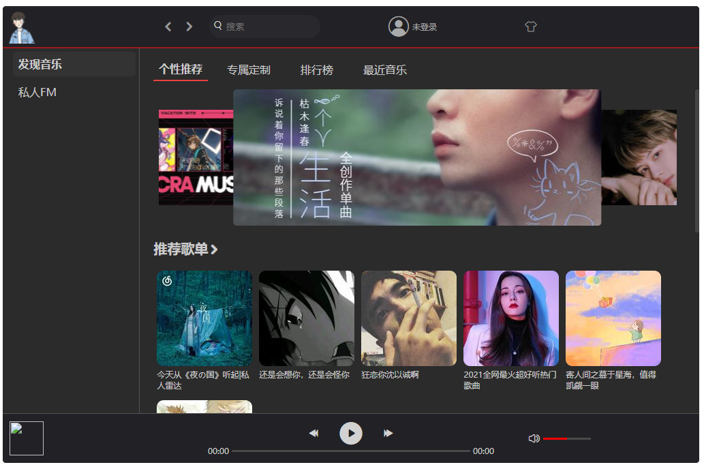
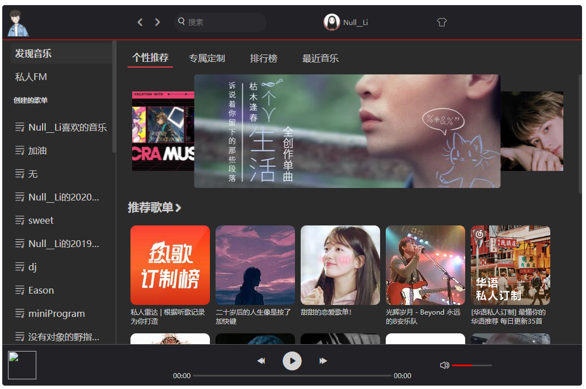
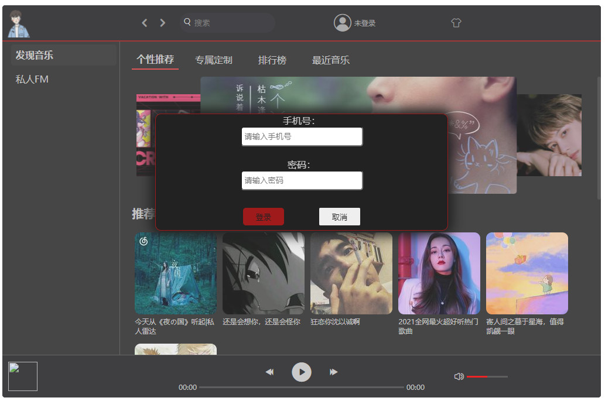
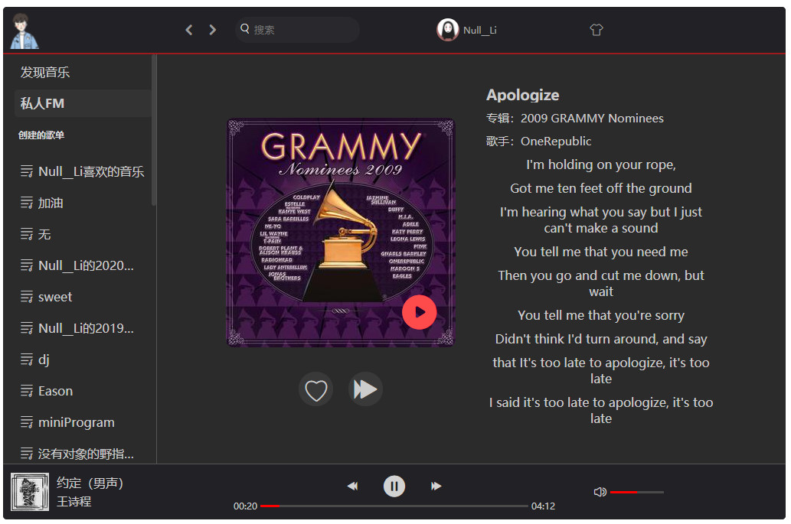
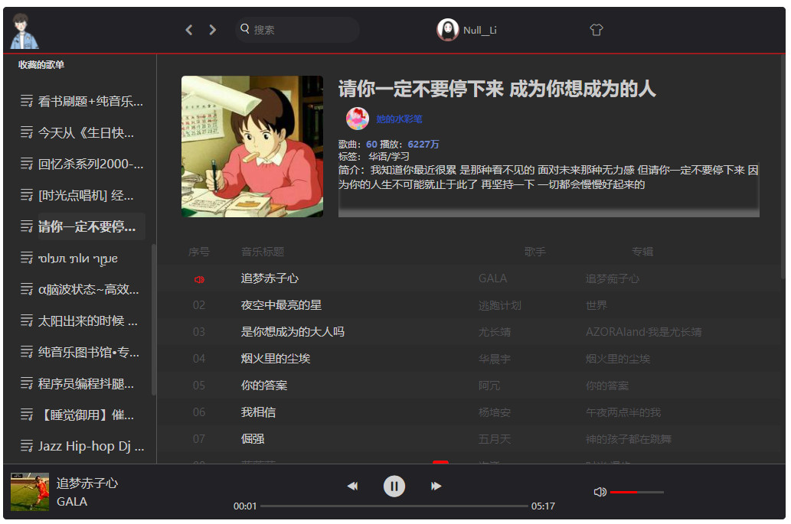
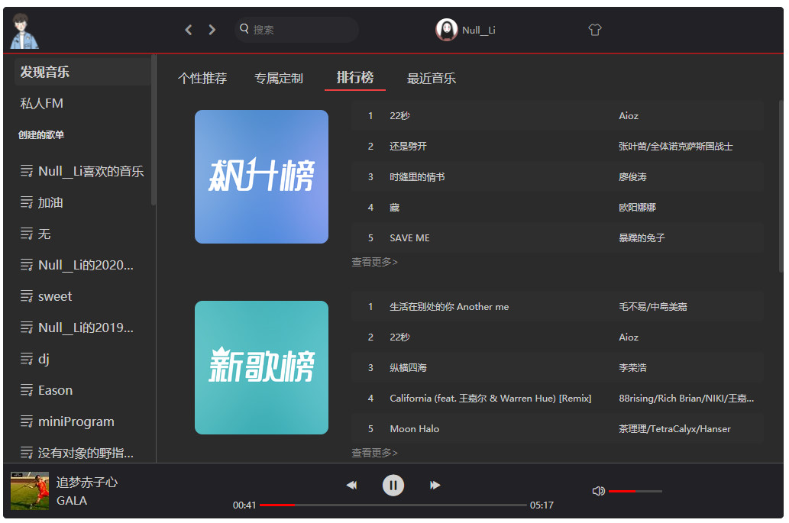
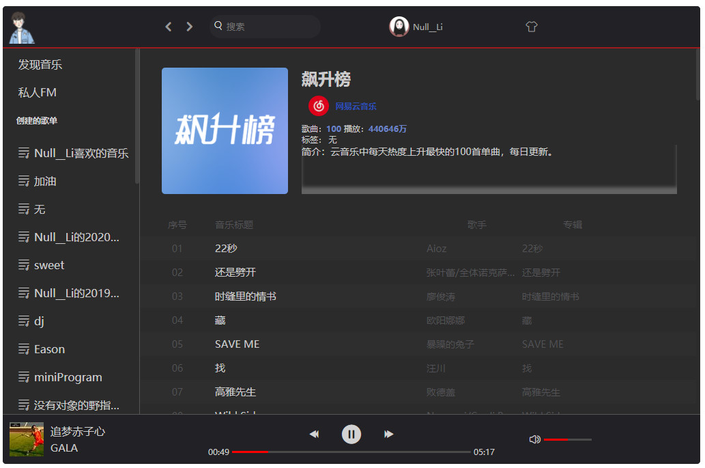
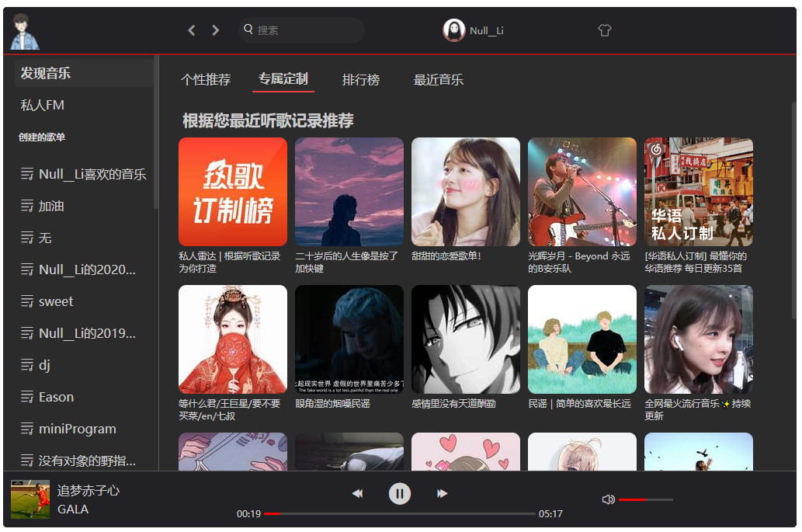

# NeteaseMusicWebAPP

学了Vue之后的第一个小项目，用起来还不是很熟练，脑子都快乱掉了。   
当前还没有写私人FM模块的东西，所以还用不了。后续会加上的。

> **注意:** 互联网并非法外之地，本项目只用于学习交流。

## 技术栈
1. Vue
2. Vuex
3. Vue router
4. Swiper
5. BetterScroll

## 项目灵感
[NeteaseCloudMusic-Vue](https://github.com/wzz1206414629/NeteaseCloudMusic-Vue)

## 数据接口来源

[Binaryify/NeteaseCloudMusicApi](https://github.com/Binaryify/NeteaseCloudMusicApi)

数据接口已部署到Vercel，api接口[https://neteaseapi.liyabai.top/](https://neteaseapi.liyabai.top/)

## 致谢

感谢[Binaryify](https://github.com/Binaryify)提供的数据接口

## 项目安装
```
npm install
```

## 开发环境运行
```
npm run serve
```

## 格式化代码ESlint
```
npm run lint
```

## 代码打包
```
npm run bulid
```

## 线上地址

😁[NeteaseMusicWebAPP](https://netease.liyabai.top/)💤

## 项目截图
 








.jpg)
.jpg)


## 更新日志
**2021.07.21**  添加了私人FM模块
**2021.07.22**  增加了点击进度跳控制播放进度，点击音量条控制音量大小

## License
[The MIT License (MIT)](https://github.com/liyabai1/NeteaseMusicWebAPP/blob/main/LICENSE)
